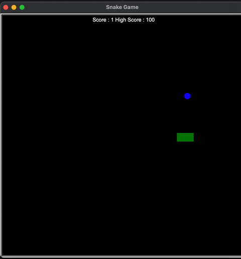

Snake Game in Python (Turtle Graphics)

This is a simple implementation of the classic Snake Game using Python's built-in `turtle` graphics module. It was developed as part of my learning and practice in Python programming during my first year of college.

---

 - About the Project

This project demonstrates:

* Basic object-oriented programming in Python
* Use of the `turtle` module for graphics and animation
* Handling keyboard input and screen updates
* Logic for collision detection and score tracking

---

Technologies Used

* Turtle module (no external libraries required)
* Pycharm as the development environment

---

How to Play

* Use the Arrow keys to control the snake:

  * 'w': Move Up
  * 's': Move Down
  * 'a': Move Left
  * 'd': Move Right

* Eat the food to grow the snake and increase your score

*The game ends if the snake collides with itself or the screen boundary

---

Demo




---

Project Structure

```
snake-game/
├── assets
    ├──demo.gif
├── src
    ├──data.txt (For saving high score)
    ├──food.py
    ├──main.py
    ├──scoreboard.py
    ├──snake.py
├── README.md

```

---


My learning

* How to create classes to organize code into reusable components.
* How to inherit from the turtle.Turtle class to extend functionality in food.py and snake.py.
* Importing and using multiple modules together in main.py to keep code clean and modular.
* Writing clean, maintainable, and shorter code by using proper logic and avoiding repetition.

---


Contact

If you’d like to know more about this project or my learning journey, feel free to reach out!

        LinkedIn: https://www.linkedin.com/in/raghul-m-6308a6300/
